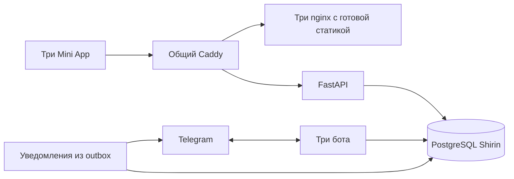

# Архитектура Shirin и ресурсы ВМ

Аудит от 7 октября 2026 года. Основания: исходный код Shirin и предоставленные оператором `docker stats`, `free`, `df`, журнал предыдущей загрузки и `last -x`. Изменения ниже подготовлены в репозитории; применение на ВМ и замер после обновления выполняются отдельно.

## Что установлено

**Основной расход памяти Shirin — отдельные Python-процессы трёх ботов и уведомлений. Причина перезагрузок всей ВМ пока не установлена.**

В первоначальной конфигурации оператор указал 2 vCPU, 2 ГБ RAM и 100 ГБ SSD. В выводе `free -h` было 1,9 GiB общей памяти, 732 MiB доступной памяти и отсутствовал swap. Свободные 86 MiB в колонке `free` сами по себе не доказывают нехватку RAM: для оценки запаса важна также колонка `available`.

В более позднем `docker stats` у всех контейнеров уже указан одинаковый предел **3,823 GiB**. При отсутствии индивидуальных ограничений это соответствует доступной Docker памяти ВМ примерно на 4 ГБ. Нельзя считать этот снимок измерением на прежней ВМ с 2 ГБ. Текущую конфигурацию нужно сверить через `free -h` и консоль облака.

| Компонент | RAM в предоставленном снимке |
| --- | ---: |
| Shirin API | 92,16 MiB |
| Shirin user bot | 197,80 MiB |
| Shirin admin bot | 214,20 MiB |
| Shirin superadmin bot | 196,30 MiB |
| Shirin worker уведомлений | 175,00 MiB |
| Shirin PostgreSQL | 38,18 MiB |
| Три панели Shirin, суммарно | 12,00 MiB |
| **Shirin, 9 работающих контейнеров** | **925,64 MiB** |
| Kulcha, включая общий gateway, 11 контейнеров | 782,91 MiB |
| **Все показанные контейнеры** | **1708,56 MiB ≈ 1,67 GiB** |

Market в этом снимке отсутствует; его будущий расход сюда не включён. Также сюда не входят ядро, Docker daemon, системные службы и процессы резервного копирования Acronis, замеченные в предыдущем `ps`. Сумма показаний контейнеров — ориентир по конкретному моменту, а не полный расход памяти хоста и не максимум под нагрузкой.

На диске свободно **76 ГБ из 97 ГБ**. Заполненность SSD в предоставленном снимке не объясняет проблему. CPU контейнеров в момент замера почти не занят; это ничего не говорит о пиках во время сборки или обработки запросов.

Фильтр журнала предыдущей загрузки вернул только `NMI watchdog: Perf NMI watchdog permanently disabled`. Эта строка не подтверждает OOM, kernel panic или перезагрузку по watchdog. `last -x` подтверждает несколько загрузок, а отметки `crash` означают незавершённые обычным выходом сессии; причину они не устанавливают. Отсутствие OOM в коротком отфильтрованном выводе также не исключает нехватку памяти в другой загрузке.

## Структура и найденные затраты

Shirin имеет собственные PostgreSQL, API, данные и права. Общий Caddy направляет HTTP-запросы в нужный проект. Использование одного gateway не объединяет базы или авторизацию Shirin, Market и Kulcha.



| Участок | До оптимизации | Практический эффект |
| --- | --- | --- |
| Python runtime | API, три бота и worker работают в пяти процессах | Четыре процесса ботов/уведомлений суммарно занимают 783,3 MiB, около 85% памяти Shirin в снимке. Каждый загружает собственный интерпретатор и библиотеки. |
| Docker build | Одинаковый backend описан как build у шести сервисов; отдельно собираются три панели Node.js | Compose может запускать несколько сборок одновременно и создавать временные пики нагрузки. Одинаковые слои Docker уже могут переиспользоваться; шесть описаний build не означают шесть независимых копий всех слоёв на диске. |
| Работа панелей | Три nginx раздают уже собранные файлы | Все три панели занимают около 12 MiB. Объединение этих контейнеров даёт гораздо меньшую экономию, чем объединение Python-процессов. Node.js нужен на этапе сборки, а не для раздачи production-панелей. |
| Соединения с БД | Пул PostgreSQL без явных настроек использует стандартные для этой конфигурации SQLAlchemy 5 постоянных мест и до 10 дополнительных на процесс | Соединения создаются по необходимости, а не все при старте. При одновременной нагрузке несколько процессов могут увеличивать число PostgreSQL-процессов и потребление памяти. |
| Изображения | До уменьшения до 2400 × 2400 создавалась RGB-копия изображения до 30 млн пикселей | Размер сжатого файла до 8 MiB не ограничивает размер декодированного изображения. Буферы декодера, RGB-копия и параллельные загрузки дают значительно больший пик RAM. |
| Импорт библиотек | Модули работы с изображениями и S3 импортировали Pillow и boto3 заранее | Память расходовалась и в процессах, которые ещё не выполняли эти операции. Excel использует стандартную библиотеку Python; отдельного тяжёлого Excel SDK в проекте нет. |

## Подготовленные изменения

1. **Необязательный компактный режим.** Три бота и цикл уведомлений работают в одном Python-процессе; API остаётся отдельным. Боты сохраняют разные токены, Dispatcher и роли. Это уменьшает число постоянно работающих контейнеров Shirin с 9 до 6, а Python-процессов — с 5 до 2. В число не включён кратковременный контейнер миграций; отдельный gateway на новой ВМ добавляет ещё один контейнер. По умолчанию сохраняется обычный режим с отдельными процессами. В компактном polling каждый бот обрабатывает по одному update за раз, ограничивая число выполняющихся обработчиков.
2. **Один backend image и последовательная сборка.** Backend собирается один раз, затем по очереди собираются три панели. Миграции, API, боты и worker используют один backend image. Это снижает число одновременных сборок, но общий image сам по себе не объединяет память отдельных работающих процессов.
3. **Запуск без сборки.** `./up.sh --no-build` использует имеющиеся локальные образы и проверяет их наличие до запуска. Он пригоден для повторного запуска уже собранной версии или заранее загруженных образов. После `git pull` новая версия кода появится в контейнерах только после сборки соответствующих образов.
4. **Меньший пул PostgreSQL.** Значения по умолчанию: `SHIRIN_DATABASE_POOL_SIZE=2`, `SHIRIN_DATABASE_MAX_OVERFLOW=1`, `SHIRIN_DATABASE_POOL_TIMEOUT=30`. Они ограничивают пул каждого процесса, а не весь PostgreSQL. Для общего `workers` Compose отдельно задаёт `SHIRIN_COMPACT_DATABASE_POOL_SIZE=4` и `SHIRIN_COMPACT_DATABASE_MAX_OVERFLOW=2`: запас нужен под транзакции очереди webhook и вложенные сессии обработчиков. В режиме PostgreSQL webhook общий процесс откажется запускаться с суммарной вместимостью пула меньше 5. Соединения открываются по необходимости. Изменять значения имеет смысл после измерения ожидания соединений под нагрузкой.
5. **Загрузка SDK по необходимости.** Pillow и boto3 загружаются при использовании изображений или S3, что уменьшает стартовый расход памяти процессов, которым эти операции не нужны.
6. **Обработка одного изображения за раз в процессе.** Отдельный исполнитель с одним потоком ограничивает число одновременно декодируемых изображений, в том числе при отмене HTTP-запроса. Уменьшение выполняется до RGB-копии; JPEG может декодироваться в уменьшенном разрешении. Очередь запросов и входные файлы всё ещё занимают память, поэтому это не абсолютный предел RAM при любой нагрузке.
7. **Ротация контейнерных логов.** Ограничивается рост логов на диске. Это профилактика заполнения диска, а не объяснение уже наблюдавшихся перезагрузок.

Фактическая экономия RAM компактного режима **ещё не измерена на этой ВМ**. Нельзя обещать конкретное число мегабайт на основании только объединения процессов. Ошибка одной задачи приводит к её повторному запуску через 5 секунд, не перезапуская остальные. Однако завершение единого процесса временно затронет все три бота и уведомления; при раздельном запуске у них отдельные процессы. Долгая синхронная операция в общем процессе также может задержать соседние задачи. При высокой нагрузке можно вернуться к раздельному режиму.

## Применение на текущей ВМ

После отправки изменений в GitHub обновите checkout на ВМ:

```bash
cd ~/shirin
git pull --ff-only
```

В существующей `.env` добавьте или измените одну строку:

```dotenv
SHIRIN_COMPACT_WORKERS=true
```

Сохраните рабочие токены, proxy, пароль БД и текущие URL. Для первого перехода на новую версию нужна сборка:

```bash
./up.sh --shared --compact
```

Это всё ещё сборка на ВМ, которая требует дополнительной памяти поверх работающих приложений. Последовательность уменьшает конкуренцию, но не задаёт верхнюю границу памяти отдельной сборки. Если ВМ не выдерживает даже одну сборку, собирайте образы в CI или на отдельной машине под архитектуру ВМ и доставляйте готовые образы на сервер.

Для последующих запусков **той же уже собранной версии**:

```bash
./up.sh --shared --compact --no-build
```

Переход между режимами должен выполняться через `up.sh`: нельзя одновременно оставлять два poller одного токена. Скрипт завершает сборки и миграции, затем останавливает прежних потребителей перед запуском новых. Для возврата к раздельному режиму поменяйте `SHIRIN_COMPACT_WORKERS=false` в `.env` и выполните `./up.sh --shared --no-build`, если образы этой версии уже собраны. `./down.sh` останавливает сервисы обоих режимов и сохраняет volumes. Настройка Caddy для `/shirin/` остаётся отдельным шагом из [deployment.md](deployment.md).

## Проверка результата

Снимите значения сразу после запуска, затем после 10–15 минут работы и обычных действий: `/start` в каждом боте, открытие каждой панели, создание заказа, импорт Excel и загрузка фотографии.

```bash
free -h
docker stats --no-stream
docker ps -a --filter label=com.docker.compose.project=shirin
docker logs --tail=80 shirin-workers
```

Ожидаемый результат в компактном режиме: PostgreSQL, API, один контейнер с ботами/уведомлениями и три панели работают; миграции завершились с кодом 0. Проверьте отсутствие старых одновременно работающих poller, сохранение прав трёх ролей и доставку уведомлений в настроенную рабочую группу.

Для причины перезагрузок нужен конец предыдущего журнала целиком, а не только поиск OOM:

```bash
sudo journalctl -b -1 -n 150 --no-pager
```

Состояние контейнеров после возможного сбоя можно проверить без вывода переменных окружения:

```bash
docker ps -aq --filter label=com.docker.compose.project=shirin | xargs -r docker inspect --format '{{.Name}} OOMKilled={{.State.OOMKilled}} ExitCode={{.State.ExitCode}} RestartCount={{.RestartCount}}'
```

Сопоставьте время перезагрузки с событиями ВМ в консоли облака и обслуживанием/обновлением ОС. `OOMKilled=true` у контейнера — свидетельство его завершения из-за памяти; это ещё не доказательство причины перезагрузки всего хоста. Пересоздание контейнера сбрасывает историю его состояния, поэтому журнал нужен отдельно.

## Размер ВМ и дальнейшие меры

При измеренных 1,67 GiB только у контейнеров Kulcha и Shirin совместное размещение на ВМ с 2 ГБ практически не оставляет резерва для ОС, Acronis и сборок. Для текущих двух проектов примерно 4 ГБ, уже видимые в последнем снимке, — разумная исходная конфигурация для проверки после оптимизации. Это рекомендация по полученным цифрам, а не испытанный минимальный размер.

Если одновременно запускаются Kulcha, Market и Shirin, особенно со сборками на том же сервере, ориентир с большим запасом — 8 ГБ RAM. Это также не гарантия: расход Market и пики нагрузки в текущем аудите не измерены. Число vCPU следует выбирать по загрузке и задержкам во время работы; одного снимка простоя недостаточно. Дополнительное место на SSD по предоставленным данным не требуется.

Swap может дать резерв при кратковременном превышении RAM, но работает медленнее памяти и не заменяет достаточный объём RAM. Его включение — отдельная настройка хоста; код Shirin её не меняет. Жёсткие лимиты контейнеров тоже следует подбирать по измеренным пикам: слишком низкий лимит будет завершать приложение даже при наличии свободной памяти у ВМ. Поведение OOM, swap и ограничений описано в [официальной документации Docker](https://docs.docker.com/engine/containers/resource_constraints/).

Для дальнейшего уменьшения риска во время обновлений самый полезный следующий шаг — сборка образов вне рабочей ВМ. Простая очистка Docker cache не уменьшает память постоянно работающих ботов и может сделать следующую сборку дольше. Последовательность операций Compose задаётся через `COMPOSE_PARALLEL_LIMIT`; это ограничение числа операций, а не лимит RAM: [Docker Compose](https://docs.docker.com/reference/cli/docker/compose/#configuring-parallelism).
